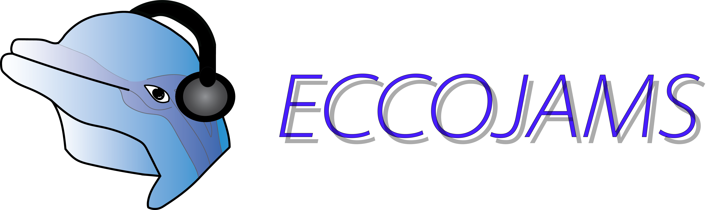

<!--  -->
<p align="center">
  
</p>

# ECCOJAMS

Jams you will return to again and again...

A set of tools for analyzing neural data after use of musclebeachtools.  Also included
are utility functions for various steps in analysis
of chronic neural and behavioral data.

Find a tutorial in:
```
tutorial/eccojams_tutorial.ipynb
```

## Installation
```
git clone https://github.com/hengenlab/eccojams.git
cd <location_of_eccojams>/eccojams/
pip install .
```

## Unzip example data for tutorial
```
cd <location_of_eccojams>/eccojams/tutorial/example_data/
unzip example_data.zip
```

## Test import
```
Open powershell/terminal
    ipython
    import eccojams as eco
```
